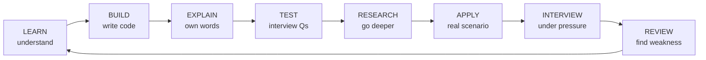
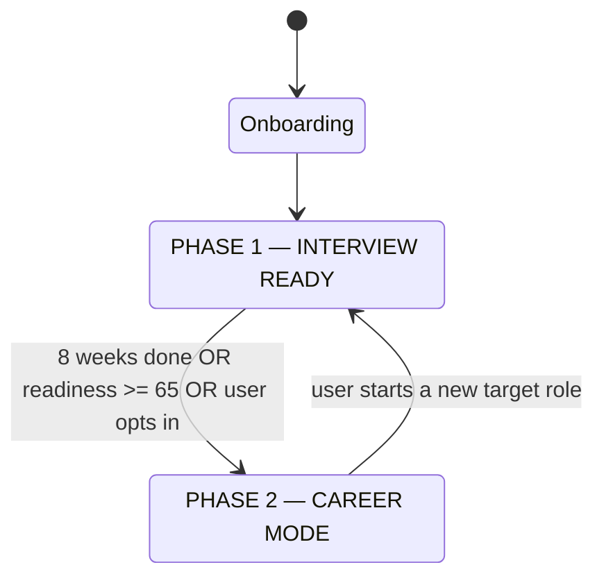

# EngForge — Product Architecture

> **Forge the Engineer Companies Want.**
> Your Engineering Career Operating System.

## 1. What EngForge is

EngForge is a career operating system for engineers targeting international
enterprise roles (US / UK / EU / CA / AU). It is not a course platform. The unit
of value is not "a lesson completed" — it is **verified capability against a
target role**, plus a daily reason to show up.

Three things make it different from a course site, a LeetCode clone, or an AI wrapper:

1. **Evidence-based mastery.** Every score traces to specific attempts. Nothing
   is derived from XP or from "marked complete".
2. **A deterministic roadmap engine.** Plans come from a skill graph + a
   constraint solver over the user's daily time budget — not from an LLM's mood.
   The LLM writes the framing; the engine decides the content.
3. **Failure is the input, not the exit.** Every failed question, interview, and
   design review is converted automatically into research, revision, and re-test.

## 2. The Forge Loop

The loop from the brief is the product's spine. Every surface exists to serve one
of its stages.



| Stage | Surface | Produces evidence of |
|---|---|---|
| Learn | Topic reader (4 explanation levels) | exposure only — lowest evidence weight |
| Build | Code Forge (coding problems, projects) | applied problem solving |
| Explain | Notebook "Explain it back" + Engineer Speak | communication, depth |
| Test | Question drills | recall, precision |
| Research | R&D Lab / Engineering Notebook | curiosity, investigation |
| Apply | Boss Battles, Incident Simulator, Projects | production judgment |
| Interview | Interview Arena, AI Interviewer | performance under pressure |
| Review | Weaknesses, Revision queue, Readiness | self-correction |

A day is only "complete" when the day's slice of the loop is closed — not when a
video ends.

## 3. Two phases, one product



**Phase 1 — Interview Ready.** Fixed-horizon (default 8 weeks), roadmap-driven,
daily mission is the primary surface. Success = readiness score and closed skill gaps.

**Phase 2 — Career Mode.** The roadmap becomes *dynamic*. Priority is driven by
the live application pipeline: job descriptions, upcoming interviews, and the
weaknesses harvested from real interviews. The daily mission still exists, but
its contents are selected by what the next interview needs.

The transition is a **suggestion, not a wall** — the user can enter Career Mode
early, and Phase 1 material stays fully available.

## 4. The three currencies (deliberately separate)

The single most important product rule, from §20 of the brief: **do not collapse
these into one number.**

| Currency | Question it answers | Derived from | Can be gamed? |
|---|---|---|---|
| **XP / Level** | "Did I put in the work?" | effort events, idempotent | mildly — and that's fine |
| **Mastery / Readiness** | "Am I actually good enough?" | scored evidence, recency-decayed | no — needs correct answers at difficulty |
| **Momentum** | "Am I still moving?" | 7-day consistency, breadth, difficulty | no — rolling window |

XP motivates. Readiness tells the truth. Momentum catches decay early. A user can
be Level 5 with 48% readiness, and the product will say so plainly.

## 5. Surface map

```
COMMAND CENTER   Today's mission, streak, momentum, next unlock, one nudge
ROADMAP          8-week plan, week themes, why each item is there
LEARN            Topics: beginner → engineer → enterprise → interview
CODE FORGE       DSA patterns + project work, attempts tracked
NOTEBOOK         Private research notes (Question→…→Interview Explanation)
R&D LAB          Experiments: hypothesis → experiment → evidence → conclusion
ARENA            Interview Arena · System Design Arena · Boss Battles · Incidents
SKILLS           Skill graph, mastery, evidence trail, weaknesses, revision queue
CAREER           Applications, JD analysis, interview memory, readiness vs role
PROFILE          Achievements, milestones, history, settings
ADMIN            Users, analytics, learning insights, content management
```

## 6. Anti-goals

- No "watch → mark complete → next".
- No childish gamification. Engineering-themed, restrained, dark-mode-native.
- No dashboard that dumps every stat. Progressive disclosure: **today** first.
- No LLM-generated curriculum at request time. Content is authored and versioned;
  AI evaluates, coaches, and personalises — it does not improvise the syllabus.
- No XP for clicking.
- No admin access to private notebooks. Enforced in the database, not the UI.

## 7. North star

> Does this make the user a better engineer, or make their preparation more effective?

Feature review checklist:
1. Which Forge Loop stage does it serve?
2. What evidence does it produce for the mastery model?
3. What does it show the user *today*?
4. Does it survive the "would a Staff engineer respect this?" test?

## 8. MVP boundary (§69)

The first shippable product is exactly this loop and nothing else:

```
Signup → Onboarding → Personalised Roadmap → Today's Mission
  → Learn → Code → Interview Question → Notebook
  → XP + Streak → Weakness detection → Revision
```

Everything in §22–§35 of the brief (Boss Battles, Incident Simulator, Design
Arena, JD intelligence, admin analytics, achievements) is built *around* that
loop in later phases. Sequencing is in [07-implementation-roadmap.md](07-implementation-roadmap.md).

## 9. Success criteria

The user opens EngForge in the morning and, without clicking anything, knows:
what to learn, why, what to build, what to research, which interview question to
answer, what they are weak at, how far they have come, and what is next.

After 8 weeks, the product answers: *am I ready, for which roles, what is still
weak, which jobs match, and what should I fix before the next interview* — with
the evidence to back each answer.
