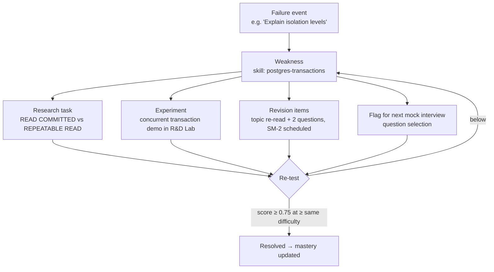
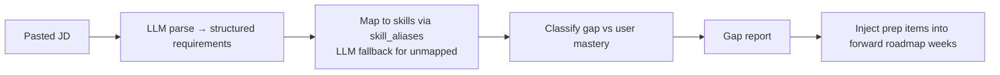

# EngForge — Domain Engines

Every engine here is a **pure function** in `src/features/*/domain/`. No I/O, no
hidden clock — time is always an argument. This is what makes the product
explainable, testable, and cheap to run.

---

## 1. The skill graph

The taxonomy is three levels, and mastery is tracked at exactly one of them.

```
domain          Frontend, Backend, Databases, Architecture, Distributed Systems,
                Security, DevOps, System Design, DSA, CS Fundamentals,
                AI Engineering, Communication
  └─ skill      the atomic unit of mastery — e.g. "postgres-indexing",
                "http-caching", "react-rendering-model", "idempotency"
       └─ topic teaching + practice material for that skill
```

- `skill_prerequisites(skill_id, prereq_skill_id, strength 0..1)` — a DAG.
- `role_track_skills(role_track_id, skill_id, weight 0..1, target_mastery)` —
  **this is what makes two users' roadmaps different.** A Frontend track weights
  `react-rendering-model` at 1.0 and `db-sharding` at 0.1; a Backend track
  inverts it. Same content library, different plan.

Role tracks shipped at launch: `full-stack`, `frontend`, `backend`,
`ai-engineer`, `platform`, `mern`, `senior-generalist`.

---

## 2. Mastery model

### Evidence

Every scored action writes an immutable `skill_evidence` row:

```ts
type Evidence = {
  skillId: string
  sourceType: EvidenceSource
  difficulty: 1 | 2 | 3 | 4 | 5
  correctness: number      // 0..1
  occurredAt: Date
}
```

**Source weights** — how much a signal actually tells us about capability:

| Source | Weight | Why |
|---|---|---|
| `mcq` | 0.5 | guessable |
| `short_answer` | 0.8 | recall, low depth |
| `explanation` | 1.2 | AI-graded against rubric; reveals understanding |
| `coding_attempt` | 1.5 | applied |
| `mock_interview_turn` | 1.8 | under pressure, adaptive follow-ups |
| `system_design_attempt` | 2.0 | synthesis |
| `boss_battle` / `incident_run` | 2.0 | production judgment |
| `real_interview_question` | 2.5 | ground truth |
| `research_note` | 0.6 | effort signal, weak capability signal |

### The formula

```
m(d)      = 0.5 + 0.25·d                        // difficulty multiplier, 0.75 … 1.75
decay(t)  = 0.5 ^ (ageDays / HALF_LIFE)         // HALF_LIFE = 45 days
w_eff     = sourceWeight · m(d) · decay(t)

rawMastery = 100 · Σ(w_eff · correctness) / Σ(w_eff)
confidence = 1 − exp( −Σw_eff / 6 )             // ~0.63 at 6 units, ~0.95 at 18

mastery    = rawMastery · confidence + prior · (1 − confidence)
```

`prior` comes from onboarding self-report, capped at **35** — claiming you know
React starts you at "Familiar", never higher. Evidence moves you from there.

**Why shrink toward a prior?** One lucky MCQ should not read as 100% mastery. Low
confidence pulls the number toward the honest baseline, and the UI shows the
confidence band explicitly rather than a false-precision percentage.

**Why decay?** §44 asks "am I actually progressing". Without decay, a skill
practised in week 1 reads as mastered in week 8. A 45-day half-life means
untouched skills visibly fade — which is exactly the signal that should drive
revision.

### Skill ranks

| Mastery | Rank |
|---|---|
| 0–19 | Novice |
| 20–39 | Familiar |
| 40–59 | Working |
| 60–74 | Proficient |
| 75–89 | Strong |
| 90–100 | Expert |

### Explainability (§21)

The skill detail page renders the evidence table directly: every row with its
raw score, difficulty, age, decayed weight, and its contribution in points. The
number is never a black box.

---

## 3. Readiness

Readiness has **two axes**, because "how good are you at databases" and "how good
are you at coding under pressure" are different questions.

### Domain axis (§21)

```
domainReadiness(D) = Σ_{s∈D} weight(s) · mastery(s) / Σ_{s∈D} weight(s)
```
Weights come from the user's role track; skills with weight 0 are excluded, so a
Frontend engineer is not marked down for not knowing sharding.

### Modality axis (§20)

| Dimension | Computed from |
|---|---|
| Knowledge | decayed accuracy over question attempts |
| Coding | coding attempt pass rate × difficulty |
| System Design | mean design rubric score |
| Architecture | mastery rollup of the Architecture domain |
| Problem Solving | coding + boss battle + incident scores |
| AI Engineering | AI domain rollup |
| Security | Security domain rollup |
| Communication | AI communication sub-scores from explanations + interview turns |
| Interview Performance | mock + real interview overall scores |
| Consistency | qualifying study days / expected days over 28d |

### Overall Engineering Readiness Score

```
blend   = 0.45·domainRollup + 0.40·modalityRollup + 0.15·consistency
weakest = min(domainReadiness(D)) over role-critical domains
penalty = 0.30 · max(0, (50 − weakest) / 50)
overall = blend · (1 − penalty)
```

The penalty is the honest part. Someone at 85% Frontend and 15% System Design is
**not** 60% ready for a Senior Full-Stack role, and the product says so:

> Overall reduced by 18% — System Design is at 20% and is critical for your target role.

Snapshots are written nightly to `readiness_snapshots` with a full `components`
JSON, which powers "your System Design score improved 12% this week" (§41).

---

## 4. XP and levels

XP is **effort currency**, never capability (§20).

| Action | XP |
|---|---|
| Complete a topic | 20 |
| Answer an interview question (scored ≥ 0.6) | 25 |
| Solve a coding challenge | 40 |
| Complete an R&D experiment | 50 |
| Complete a system design | 100 |
| Complete a boss battle | 120 |
| Complete a mock interview | 150 |
| Complete a weekly mission | 200 |
| Log a real interview + reflection | 80 |

Rules:
- **Idempotent.** `xp_transactions` has a unique index on
  `(user_id, source_type, source_id)`. Re-submitting cannot re-award.
- **Diminishing repeats.** Re-attempting the same item: 25% on the 2nd, 0%
  thereafter — practice is encouraged, farming is not.
- **No XP for navigation.** Opening a page, expanding a section, scrolling: zero.
- **Failure still pays a little.** A genuine attempt that scores below threshold
  earns 30% — because the weakness it creates is worth more than the XP.

### Levels (§17)

| Level | Name | XP |
|---|---|---|
| 1 | Apprentice | 0 |
| 2 | Builder | 500 |
| 3 | Engineer | 1 500 |
| 4 | Production Engineer | 3 500 |
| 5 | Senior Engineer | 7 000 |
| 6 | Staff Engineer | 12 000 |
| 7 | Principal Engineer | 20 000 |

These are **platform ranks**. The UI states this wherever a level is shown:
*"Platform rank — reflects work done on EngForge, not a job title."* Readiness,
not level, is what the career surfaces use.

---

## 5. Streaks (§19)

A day **qualifies** when:

```
completedItems ≥ 1  AND  completedMinutes ≥ min(15, plannedMinutes)
```

15 minutes is enough. The streak measures showing up, not grinding.

- **Rest days.** The user picks study days in onboarding. Non-study days are
  neutral — they neither extend nor break a streak.
- **Streak Shields.** Earn 1 per 7 consecutive qualifying days, hold max 3. A
  missed study day silently consumes a shield instead of resetting.
- **Repair window.** Even with no shield, completing a session within 48h of a
  break restores the streak once per 30 days.

Tracked: current, longest, total study days, total minutes, weekly consistency,
monthly consistency.

---

## 6. Momentum (§44)

7-day rolling score, 0–100 — the "am I actually progressing" number.

| Component | Weight | Measure |
|---|---|---|
| Consistency | 30% | qualifying days / expected study days |
| Completion | 20% | items completed / items planned |
| Difficulty | 20% | mean difficulty of completed items ÷ 5 |
| Recall | 15% | revision items answered correctly on/near due date |
| Breadth | 15% | distinct Forge Loop modalities used ÷ 5 |

Breadth matters: a week of only reading topics scores badly even at 100%
completion, because the loop was never closed.

Momentum bands: `< 35` Cooling · `35–59` Warming · `60–79` Forging · `≥ 80` White Hot.

---

## 7. Roadmap generator (§6, §7)

Fully deterministic. Same inputs → same plan. The LLM only writes the prose
around it.

**Inputs:** role track, experience level, self-reported skills, onboarding
assessment results, `daily_minutes`, study days, weeks, start date, target
market/companies, and (Phase 2) aggregated JD requirements.

### Algorithm

```
1. CANDIDATES  skills where role_track_skills.weight > 0

2. PRIORITY    p(s) = weight(s)
                    · gap(s)              // (target − mastery)/100, floored at 0
                    · prereqReady(s)      // 0 if any prereq mastery < 40, else 1
                    · marketSignal(s)     // 1.0 default; >1 if frequent in target JDs

3. WEEK THEMES for each week 1..N:
                 pick the domain cluster with highest summed p among schedulable
                 skills; a skill becomes schedulable once its prereqs are
                 scheduled in an earlier week

4. WEEK FILL   assign topics, coding problems, question sets, one research task,
               one weekly mission, and (week ≥ 2) one boss battle

5. DAY FILL    bin-pack week items into study days under `daily_minutes`,
               following the loop mix below

6. REASON      every roadmap_item stores
               { weight, gap, prereqsMet, source: 'role_track'|'jd_gap'|'weakness' }
```

### Daily composition (60-minute example)

| Slot | Share | 60 min | Notes |
|---|---|---|---|
| Review (due revision) | 15% | 9 | **always first, always wins** |
| Learn | 25% | 15 | one topic |
| Build | 25% | 15 | coding or project increment |
| Explain | 12% | 7 | write it in your own words |
| Test | 13% | 8 | 2–3 interview questions |
| Research | 10% | 6 | one focused question |

Scaling rules:
- **≥ 90 min:** add a second Build block or a system design case.
- **30–45 min:** drop Research; alternate Build/Test day to day.
- **15 min:** Review + one Test block only. The streak stays alive; the plan stays honest.

**Hard invariant (§7):** `Σ plannedMinutes ≤ daily_minutes`. Unit-tested.
If revision debt exceeds the budget, new material is deferred — never stacked on top.

### Regeneration

Roadmaps are versioned. Phase 2 re-plans **forward weeks only**; completed weeks
are immutable history. Triggers for re-plan: new JD analysed, interview logged,
weakness count on a critical skill crosses threshold, or the user changes target
role / available time.

---

## 8. Failure → Skill engine (§11, §12)

The signature feature. Failure is an input event, not a dead end.

### Triggers that open a weakness

| Trigger | Severity |
|---|---|
| Question scored < 0.5 twice on a skill within 14 days | 1 |
| Coding attempt failed or abandoned | 1 |
| System design dimension < 50 | 2 |
| Mock interview turn flags a missing concept | 2 |
| Real interview question marked `shaky` | 2 |
| Real interview question marked `failed` | 3 |

### On open, generate automatically



### Resolution rules

- `open → researching` when the research task is started.
- `researching → retesting` when all revision items have ≥ 1 correct response.
- `retesting → resolved` only on a **new** evidence event scoring ≥ 0.75 at
  equal-or-higher difficulty. **Never resolved by the item that opened it.**
- Resolved weaknesses stay in history and feed the "most common weakness"
  admin insight (§34).

### Spaced repetition (SM-2 lite)

```
intervals: 1 → 3 → 7 → 16 → 35 days
correct:   interval = round(interval · ease); ease += 0.1 (max 2.8)
wrong:     interval = 1;                      ease −= 0.2 (min 1.3)
```
Due revision items are injected into the daily plan's Review slot before any new
material is scheduled.

---

## 9. Interview question selection (§25)

Weighted sampling, no repeats within 21 days unless due for revision:

| Pool | Share |
|---|---|
| Open weaknesses | 50% |
| Lowest `mastery × confidence` in role track | 25% |
| Skills required by active applications' JDs | 15% |
| Random in-track (breadth / surprise) | 10% |

The AI Interviewer takes the selected seed question and drives follow-ups
adaptively — it does not pick the topic.

---

## 10. Job Description Intelligence (§10)



Gap classification, given `target` = role-track target mastery for that skill:

| Class | Condition |
|---|---|
| **Strong Match** | `mastery ≥ target` and `confidence ≥ 0.5` |
| **Partial Match** | `mastery ≥ 0.6 · target` |
| **Skill Gap** | `mastery ≥ 0.25 · target` |
| **Critical Gap** | below that **and** requirement importance = `required` |

Unmapped requirements are surfaced to admin as candidate new skills — the
curriculum grows from real job market data rather than guesswork.

---

## 11. Engine invariants (must never regress)

1. A generated daily plan never exceeds `daily_minutes`.
2. Due revision is scheduled before any new material.
3. XP is awarded at most once per `(user, source_type, source_id)`.
4. Mastery cannot increase without a new `skill_evidence` row.
5. A weakness cannot be resolved by the attempt that opened it.
6. Readiness is reproducible from `skill_evidence` alone — no hidden state.
7. Skills with role-track weight 0 never affect that user's readiness.
