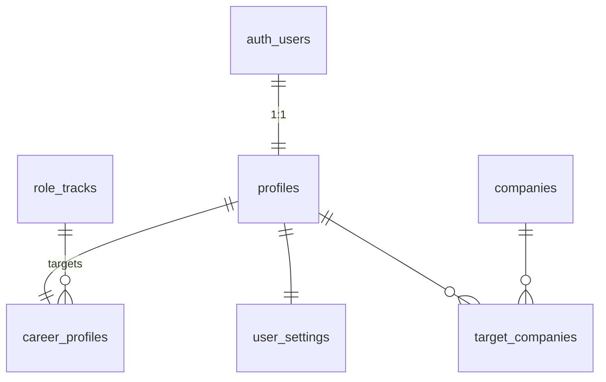
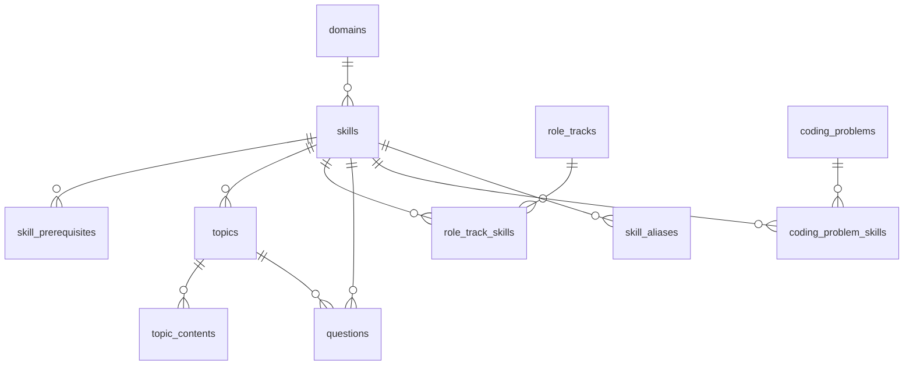
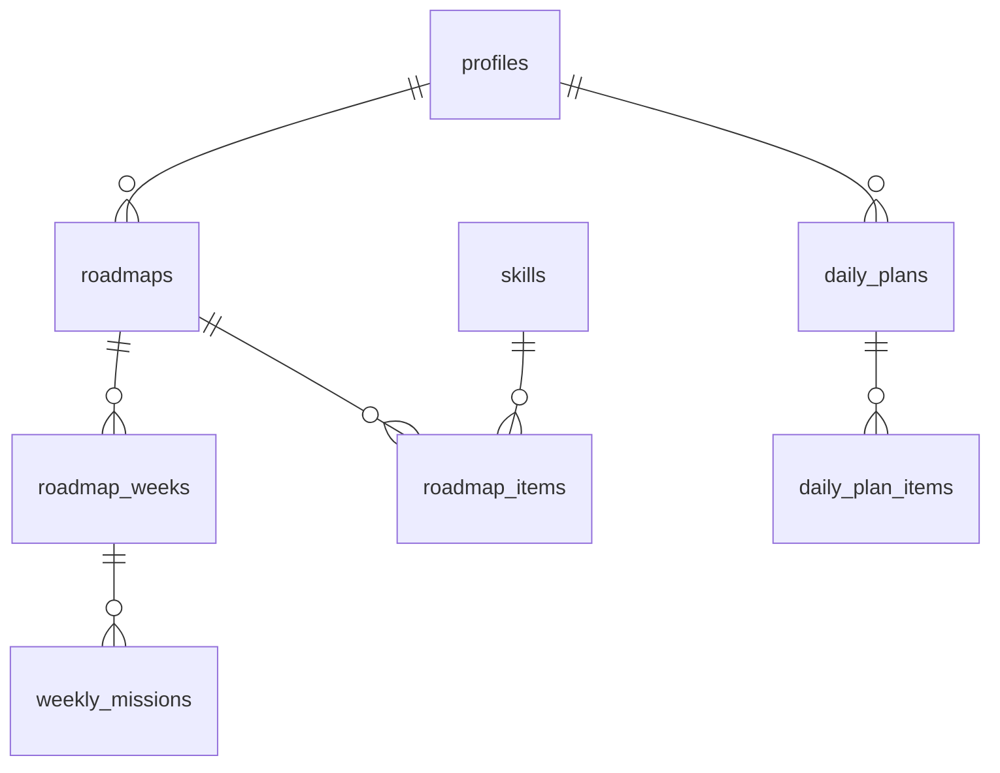
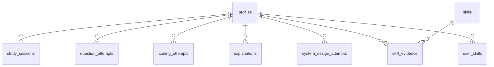
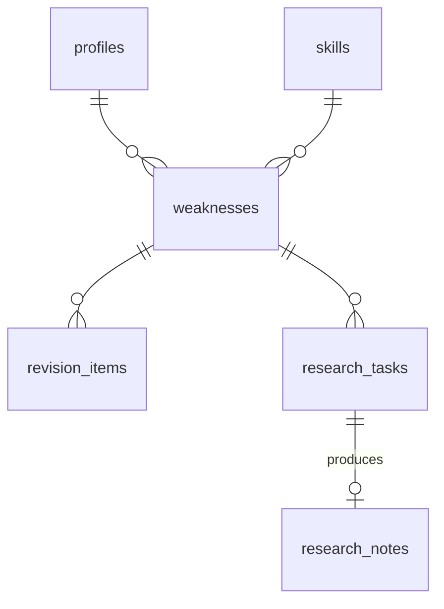

# EngForge — Database Schema

Postgres via Supabase. SQL migrations in `supabase/migrations/` are the **source
of truth**; TypeScript types are generated from the database, never the reverse.

## Conventions

- `id uuid primary key default gen_random_uuid()` unless noted.
- `user_id uuid not null references auth.users(id) on delete cascade` on all
  user-owned tables.
- `created_at timestamptz not null default now()`, `updated_at` maintained by a
  shared `set_updated_at()` trigger.
- Slugs (`citext`, unique) on every content table — stable public identifiers.
- Money/scores: `numeric(5,2)`. Never floats for anything user-visible.
- Every table declares a **privacy class** (see
  [01-technical-architecture.md §6](01-technical-architecture.md)):
  `public_content` · `owner_only` · `owner_plus_admin` · `admin_only`.

## Enums

```sql
app_role            user | admin | super_admin
experience_level    beginner | junior | mid | senior | staff | transition
user_phase          onboarding | phase1 | phase2
skill_rank          novice | familiar | working | proficient | strong | expert
content_status      draft | in_review | published | archived
question_kind       mcq | short_answer | explain | followup
evidence_source     mcq | short_answer | explanation | coding_attempt |
                    mock_interview_turn | system_design_attempt | boss_battle |
                    incident_run | real_interview_question | research_note
loop_stage          learn | build | explain | test | research | apply | interview | review
plan_item_status    pending | in_progress | completed | skipped | deferred
weakness_status     open | researching | retesting | resolved | dismissed
application_status  saved | preparing | applied | recruiter_screen |
                    technical_screen | technical_interview | system_design |
                    behavioral | final | offer | rejected | withdrawn
interview_stage     recruiter | technical_screen | technical | system_design |
                    behavioral | final | take_home
answer_quality      strong | shaky | failed | unanswered
gap_class           strong | partial | gap | critical
requirement_kind    required | preferred
note_kind           notebook | experiment
```

---

## 1. Identity & profile



| Table | Class | Key columns |
|---|---|---|
| `profiles` | owner_plus_admin | `id` (=auth.users.id), `display_name`, `handle` citext unique, `avatar_url`, `role app_role default 'user'`, `timezone`, `locale`, `plan`, `created_at`, `last_active_at` |
| `user_settings` | owner_only | `user_id` pk, `theme`, `reminder_at time`, `notification_prefs jsonb`, `keyboard_hints bool` |
| `career_profiles` | owner_plus_admin | `user_id` pk, `role_track_id`, `experience_level`, `target_markets text[]`, `daily_minutes int check (between 15 and 180)`, `study_days smallint[]` (0–6), `start_date date`, `phase user_phase`, `phase_started_at`, `onboarding_completed_at` |
| `companies` | public_content | `slug`, `name`, `country`, `careers_url`, `created_by` (null = curated), `is_public bool` |
| `target_companies` | owner_plus_admin | `user_id`, `company_id`, `priority smallint` — pk `(user_id, company_id)` |

`profiles.role` is the RBAC anchor. A `SECURITY DEFINER` helper
`public.is_admin()` reads it once and is used by every admin RLS policy — never a
subquery on `profiles` inside a policy on `profiles` (infinite recursion).

---

## 2. Taxonomy & content



| Table | Class | Key columns |
|---|---|---|
| `domains` | public_content | `slug`, `name`, `description`, `sort_order`, `icon` |
| `skills` | public_content | `slug`, `domain_id`, `name`, `summary`, `difficulty smallint 1..5`, `status content_status` |
| `skill_prerequisites` | public_content | `skill_id`, `prereq_skill_id`, `strength numeric` — pk both; `check (skill_id <> prereq_skill_id)`; DAG enforced by a trigger doing a cycle check |
| `skill_aliases` | public_content | `skill_id`, `alias citext` — powers JD → skill mapping (§10) |
| `role_tracks` | public_content | `slug`, `name`, `description`, `is_default` |
| `role_track_skills` | public_content | `role_track_id`, `skill_id`, `weight numeric 0..1`, `target_mastery smallint`, `is_critical bool` — **the roadmap differentiator** |
| `topics` | public_content | `slug`, `skill_id`, `title`, `estimated_minutes`, `difficulty`, `status`, `version int`, `sort_order` |
| `topic_contents` | public_content | `topic_id`, `kind` (`beginner`\|`engineer`\|`enterprise`\|`interview`\|`visual`\|`code`\|`scenario`\|`mistakes`\|`tradeoffs`\|`performance`\|`security`), `body_md`, `sort_order` — unique `(topic_id, kind, sort_order)` |
| `questions` | public_content | `slug`, `topic_id` nullable, `skill_id`, `kind question_kind`, `prompt_md`, `difficulty`, `choices jsonb`, `answer_key jsonb`, `rubric jsonb`, `expected_points jsonb`, `is_interview bool`, `followup_seeds jsonb`, `status` |
| `coding_problems` | public_content | `slug`, `title`, `pattern`, `difficulty`, `statement_md`, `starter_code jsonb`, `tests jsonb`, `target_complexity`, `hints jsonb`, `status` |
| `coding_problem_skills` | public_content | `problem_id`, `skill_id`, `weight` |
| `system_design_cases` | public_content | `slug`, `title`, `brief_md`, `constraints jsonb`, `traffic_profile jsonb`, `rubric jsonb`, `reference_architecture_md`, `status` |
| `boss_battles` | public_content | `slug`, `title`, `scenario_md`, `week_hint`, `rubric jsonb`, `xp`, `badge_id` |
| `incident_scenarios` | public_content | `slug`, `title`, `opening_md`, `timeline jsonb`, `root_cause_md`, `rubric jsonb` |
| `incident_reveals` | public_content | `scenario_id`, `step`, `probe` (metrics\|logs\|traces\|deploys\|db\|deps), `content_md`, `cost_minutes` |
| `projects` | public_content | `slug`, `title`, `brief_md`, `skills[]`, `estimated_hours` |
| `project_milestones` | public_content | `project_id`, `index`, `title`, `requirements jsonb`, `rubric jsonb` |

**Content visibility:** `public_content` RLS is
`status = 'published' OR is_admin()` — drafts are invisible to users, and the
admin CMS works through the same table without a second code path.

`reference_architecture_md` and `incident_scenarios.root_cause_md` are **never**
selected by the user-facing query layer until an attempt row exists (§59). This
is enforced by a dedicated view (`system_design_cases_public`) that omits the
column, plus an RPC that returns it only when `system_design_attempts.submitted_at
is not null`.

---

## 3. Roadmap & daily planning



| Table | Class | Key columns |
|---|---|---|
| `roadmaps` | owner_plus_admin | `user_id`, `role_track_id`, `version int`, `status` (`active`\|`superseded`), `start_date`, `weeks`, `daily_minutes`, `generator_version`, `params jsonb`, `generated_at` — partial unique index: one `active` per user |
| `roadmap_weeks` | owner_plus_admin | `roadmap_id`, `week_index`, `theme`, `domain_id`, `summary_md`, `status` |
| `roadmap_items` | owner_plus_admin | `roadmap_id`, `week_index`, `skill_id`, `ref_type` (`topic`\|`coding_problem`\|`question_set`\|`system_design`\|`boss_battle`\|`project_milestone`\|`research`), `ref_id`, `planned_minutes`, `sort_order`, `reason jsonb`, `status` |
| `weekly_missions` | owner_plus_admin | `roadmap_id`, `week_index`, `title`, `requirements jsonb`, `rubric jsonb`, `status`, `score`, `submission_md`, `completed_at` |
| `daily_plans` | owner_plus_admin | `user_id`, `plan_date date`, `roadmap_id`, `planned_minutes`, `completed_minutes`, `status`, `qualified bool`, `generated_at` — unique `(user_id, plan_date)` |
| `daily_plan_items` | owner_plus_admin | `daily_plan_id`, `stage loop_stage`, `ref_type`, `ref_id`, `skill_id`, `planned_minutes`, `xp_available`, `status plan_item_status`, `sort_order`, `completed_at`, `source` (`roadmap`\|`revision`\|`weakness`\|`jd`) |

`reason jsonb` on `roadmap_items` is what powers "why is this here?" in the UI:
`{"weight":0.9,"gap":0.62,"prereqsMet":true,"source":"role_track"}`.

A DB-level check plus a domain unit test enforce the §7 invariant
`sum(planned_minutes) <= career_profiles.daily_minutes`.

---

## 4. Practice & evidence



| Table | Class | Key columns |
|---|---|---|
| `study_sessions` | owner_plus_admin | `user_id`, `started_at`, `ended_at`, `minutes`, `source`, `daily_plan_id` |
| `question_attempts` | owner_plus_admin | `user_id`, `question_id`, `response_text`, `selected jsonb`, `score numeric 0..1`, `is_correct`, `ai_eval jsonb`, `prompt_version`, `seconds`, `hints_used`, `attempt_no` |
| `coding_attempts` | owner_plus_admin | `user_id`, `problem_id`, `language`, `code`, `status`, `tests_passed`, `tests_total`, `seconds`, `hints_used`, `complexity_claim`, `ai_review jsonb` |
| `explanations` | owner_plus_admin | `user_id`, `topic_id`, `skill_id`, `body_md`, `level_claimed`, `ai_eval jsonb` (clarity, precision, depth, missing concepts) |
| `system_design_attempts` | owner_only | `user_id`, `case_id`, `submission_md`, `diagram_mermaid`, `scores jsonb` (8 dimensions), `ai_feedback jsonb`, `submitted_at` |
| `boss_battle_attempts` | owner_plus_admin | `user_id`, `battle_id`, `analysis_md`, `scores jsonb`, `completed_at` |
| `incident_runs` | owner_plus_admin | `user_id`, `scenario_id`, `elapsed_minutes`, `hypothesis_md`, `mitigation_md`, `score`, `completed_at` |
| `incident_actions` | owner_plus_admin | `run_id`, `reveal_id`, `taken_at` — the investigation trail |
| `project_progress` | owner_plus_admin | `user_id`, `milestone_id`, `status`, `repo_url`, `notes_md`, `score` |
| **`skill_evidence`** | owner_plus_admin | `user_id`, `skill_id`, `source_type evidence_source`, `source_id uuid`, `difficulty smallint`, `correctness numeric 0..1`, `weight numeric`, `occurred_at` — **append-only, never updated or deleted** |
| `user_skills` | owner_plus_admin | `user_id`, `skill_id`, `mastery numeric`, `confidence numeric`, `rank skill_rank`, `evidence_count`, `last_practiced_at`, `recomputed_at` — pk `(user_id, skill_id)`; a **materialised cache** of `skill_evidence` |
| `readiness_snapshots` | owner_plus_admin | `user_id`, `snapshot_date`, `role_track_id`, `overall numeric`, `by_domain jsonb`, `by_dimension jsonb`, `components jsonb` — unique `(user_id, snapshot_date)` |
| `momentum_snapshots` | owner_plus_admin | `user_id`, `snapshot_date`, `score`, `components jsonb` |

**`skill_evidence` is the ledger.** `user_skills` can be dropped and fully
rebuilt from it — that is invariant #6 in
[02-domain-engines.md](02-domain-engines.md#11-engine-invariants-must-never-regress).
Recomputation happens in `recompute_user_skill(user_id, skill_id)`, called in the
same transaction as the evidence insert.

Indexes: `skill_evidence (user_id, skill_id, occurred_at desc)`,
`question_attempts (user_id, question_id, created_at desc)`.

---

## 5. Weakness → revision loop



| Table | Class | Key columns |
|---|---|---|
| `weaknesses` | owner_plus_admin | `user_id`, `skill_id`, `severity smallint 1..3`, `status weakness_status`, `source_type`, `source_id`, `evidence jsonb`, `opened_at`, `resolved_at`, `resolved_by_evidence_id` — partial unique on `(user_id, skill_id)` where status ≠ resolved |
| `revision_items` | owner_plus_admin | `user_id`, `weakness_id` nullable, `ref_type`, `ref_id`, `due_at`, `interval_days`, `ease numeric default 2.5`, `repetitions`, `last_result`, `last_reviewed_at` |
| `research_tasks` | owner_plus_admin | `user_id`, `weakness_id`, `prompt_md`, `status`, `note_id`, `completed_at` |

`resolved_by_evidence_id` enforces invariant #5 in SQL: a weakness cannot point
back at the evidence row that opened it (`check (resolved_by_evidence_id <> source_id)`).

---

## 6. Notebook & R&D Lab — **private**

| Table | Class | Key columns |
|---|---|---|
| `research_notes` | **owner_only** | `user_id`, `kind note_kind`, `title`, `topic_id`, `skill_id`, `question_md`, `hypothesis_md`, `research_md`, `experiment_md`, `code_md`, `result_md`, `evidence_md`, `conclusion_md`, `interview_explanation_md`, `open_questions_md`, `confidence smallint`, `tags text[]`, `status`, `completed_at` |
| `note_links` | **owner_only** | `note_id`, `ref_type`, `ref_id` |

§13 (Engineering Notebook) and §14 (R&D Lab) are the same shape with different UI
emphasis — one table, discriminated by `kind`. Normalising them apart would
duplicate eleven columns for no gain.

**RLS is `user_id = auth.uid()` only.** No admin clause. Admin cannot read these
rows even with a valid admin JWT — this is the §36 guarantee, in the database.

Full-text search: a generated `tsvector` column over the markdown fields with a
GIN index, powering global search (§50) within the owner's own rows.

---

## 7. Interviews

| Table | Class | Key columns |
|---|---|---|
| `mock_interviews` | owner_plus_admin | `user_id`, `mode`, `role_track_id`, `duration_minutes`, `started_at`, `ended_at`, `status`, `overall_score`, `dimension_scores jsonb`, `feedback_md` |
| `mock_interview_turns` | **owner_only** | `interview_id`, `turn_index`, `speaker` (`interviewer`\|`candidate`), `content`, `question_id`, `eval jsonb` |
| `interview_records` | owner_plus_admin | `user_id`, `company_id`, `role_title`, `stage interview_stage`, `occurred_at`, `outcome`, `confidence smallint`, `notes_md` |
| `interview_record_questions` | owner_plus_admin | `record_id`, `question_text`, `quality answer_quality`, `skill_id` nullable, `unexpected bool`, `weakness_id` |

`interview_records.notes_md` is stripped from every admin-facing view.
`mock_interview_turns` is fully `owner_only` — transcripts are private; only the
aggregate scores on `mock_interviews` are visible to analytics.

---

## 8. Career

| Table | Class | Key columns |
|---|---|---|
| `job_descriptions` | **owner_only** (raw) | `user_id`, `company_id`, `title`, `raw_text`, `source_url`, `parsed jsonb`, `parsed_at`, `prompt_version` |
| `jd_requirements` | owner_plus_admin | `jd_id`, `skill_id` nullable, `raw_label`, `kind requirement_kind`, `gap_class`, `user_mastery_at_parse numeric` |
| `applications` | owner_plus_admin | `user_id`, `company_id`, `jd_id`, `role_title`, `status application_status`, `applied_at`, `next_event_at`, `notes_md` |
| `application_events` | owner_plus_admin | `application_id`, `status`, `occurred_at`, `note` |

`jd_requirements.skill_id is null` rows are the curriculum growth signal: admin
sees "requirements we can't map yet", ranked by frequency (§34/§35).

---

## 9. Gamification

| Table | Class | Key columns |
|---|---|---|
| `xp_transactions` | owner_plus_admin | `user_id`, `amount int`, `source_type`, `source_id`, `multiplier numeric`, `occurred_at` — **unique `(user_id, source_type, source_id)`** |
| `user_progress` | owner_plus_admin | `user_id` pk, `total_xp`, `level smallint`, `level_name`, `updated_at` |
| `streaks` | owner_plus_admin | `user_id` pk, `current_streak`, `longest_streak`, `last_qualified_date`, `shields smallint`, `total_study_days`, `total_minutes`, `repair_used_at` |
| `achievements` | public_content | `slug`, `name`, `description`, `category` (`skill`\|`consistency`\|`career_milestone`\|`arena`), `criteria jsonb`, `xp`, `tier`, `icon` |
| `user_achievements` | owner_plus_admin | `user_id`, `achievement_id`, `progress jsonb`, `unlocked_at` — pk both |

The unique constraint on `xp_transactions` is the entire anti-farming mechanism —
enforced by Postgres, not application code (invariant #3).

Career milestones (§46) are `achievements` rows with `category='career_milestone'`,
not a separate table.

---

## 10. Platform

| Table | Class | Key columns |
|---|---|---|
| `user_events` | admin_only (aggregate) + owner read | `user_id`, `name`, `payload jsonb`, `session_id`, `occurred_at` — append-only, partitioned by month |
| `notifications` | owner_only | `user_id`, `kind`, `title`, `body`, `action_url`, `read_at`, `created_at` |
| `admin_audit_logs` | admin_only | `actor_id`, `action`, `target_type`, `target_id`, `meta jsonb`, `occurred_at` |
| `ai_usage` | owner_plus_admin | `user_id`, `feature`, `model`, `input_tokens`, `output_tokens`, `cost_usd`, `occurred_at` |
| `rate_limit_buckets` | admin_only | `key text pk`, `tokens numeric`, `refilled_at` |

### Analytics views (materialised, refreshed by cron)

`mv_daily_active_users` · `mv_retention_cohorts` · `mv_topic_difficulty`
(attempt→failure rate per topic) · `mv_question_failure_rates` ·
`mv_common_weaknesses` (open weaknesses grouped by skill) ·
`mv_roadmap_completion`.

All are built **only** from `user_events` and `owner_plus_admin` tables — never
from `owner_only` tables. That is what makes §34's "what are users struggling
with" answerable without touching a single private note.

---

## 11. RLS policy templates

```sql
-- public_content
create policy read_published on topics for select to authenticated
  using (status = 'published' or public.is_admin());

-- owner_only  (no admin clause — deliberate)
create policy owner_all on research_notes for all to authenticated
  using (user_id = auth.uid()) with check (user_id = auth.uid());

-- owner_plus_admin
create policy owner_rw on user_skills for all to authenticated
  using (user_id = auth.uid()) with check (user_id = auth.uid());
create policy admin_read on user_skills for select to authenticated
  using (public.is_admin());

-- admin_only
create policy admin_only on admin_audit_logs for select to authenticated
  using (public.is_admin());
```

Every table gets `alter table … enable row level security` **and**
`force row level security`, so even the table owner is subject to policies.
Tables with no policy are unreachable by design.

## 12. Migration order

```
0001_extensions_enums_helpers    citext, pgcrypto, enums, is_admin(), set_updated_at()
0002_identity                    profiles, user_settings, career_profiles, companies
0003_taxonomy                    domains, skills, prerequisites, role_tracks, aliases
0004_content                     topics, topic_contents, questions, coding_problems
0005_roadmap                     roadmaps, weeks, items, daily_plans, plan_items
0006_evidence                    skill_evidence, user_skills, attempts, recompute fn
0007_gamification                xp_transactions, user_progress, streaks, achievements
0008_weakness_loop               weaknesses, revision_items, research_tasks
0009_notebook                    research_notes, note_links  (owner_only)
0010_interviews                  mock_interviews, turns, interview_records
0011_career                      job_descriptions, jd_requirements, applications
0012_arena                       system_design_cases, boss_battles, incidents, projects
0013_platform                    user_events, notifications, audit, ai_usage, rate limits
0014_analytics_views             materialised views + refresh function
```

Migrations 0001–0007 cover the MVP loop (§69). Everything after is additive.
