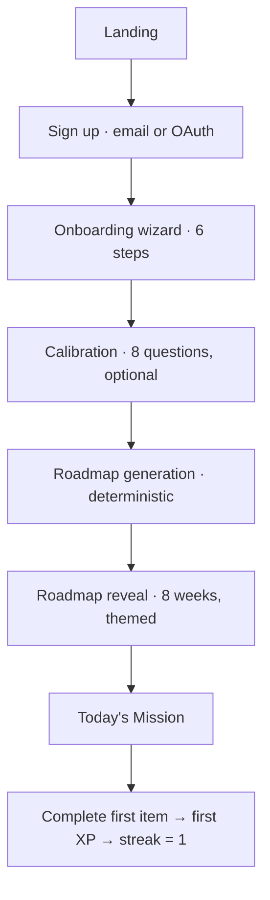
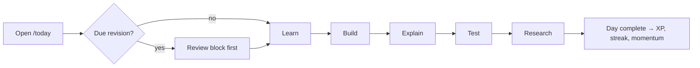
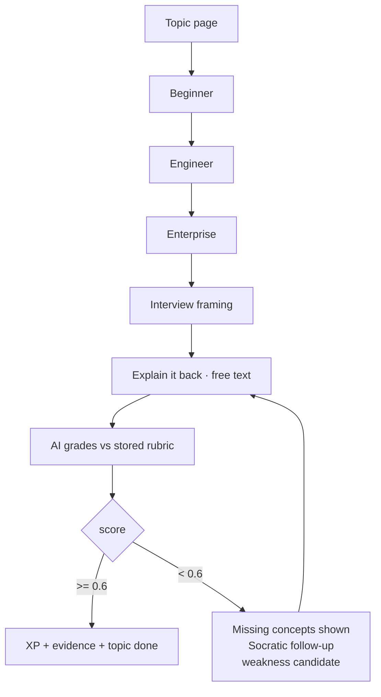
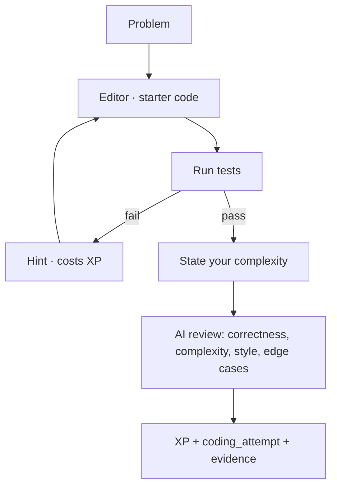
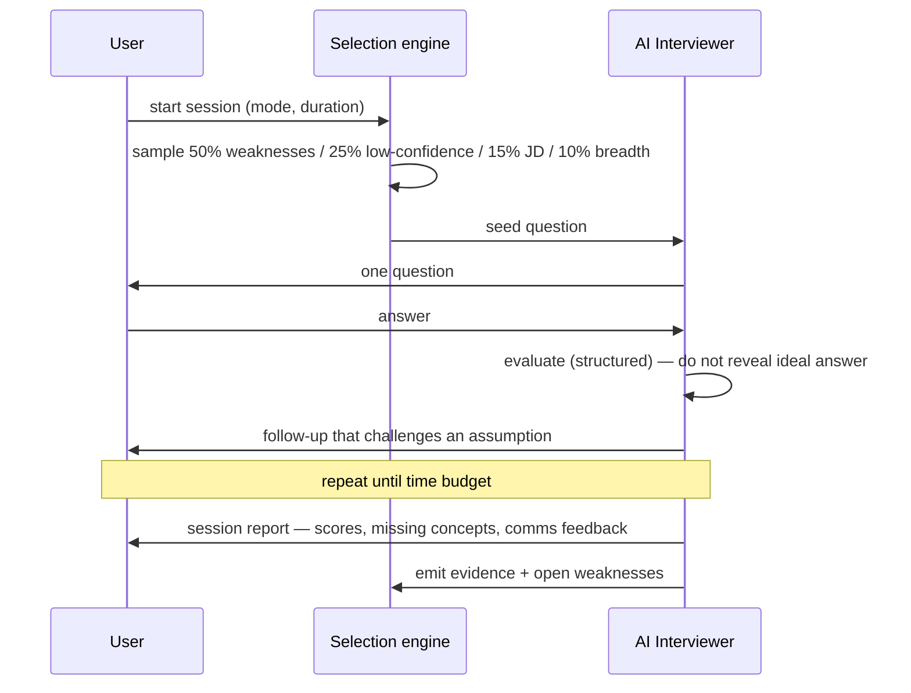
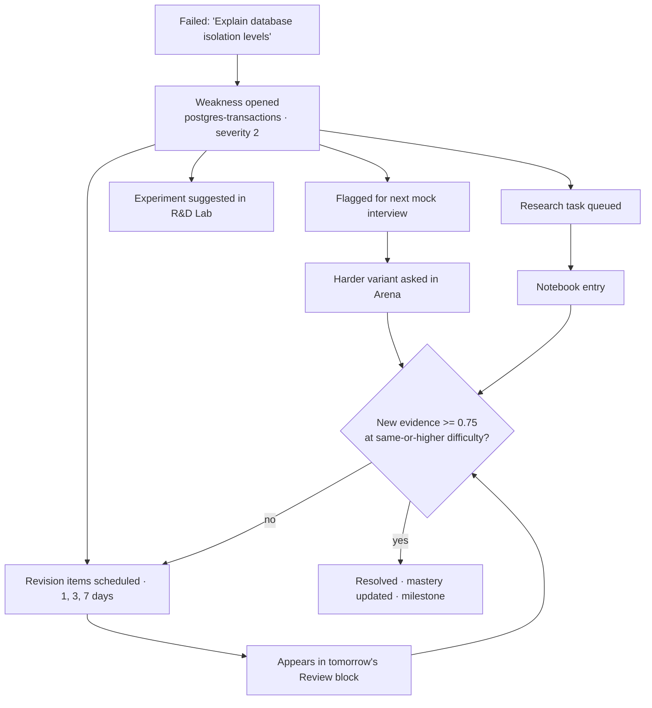
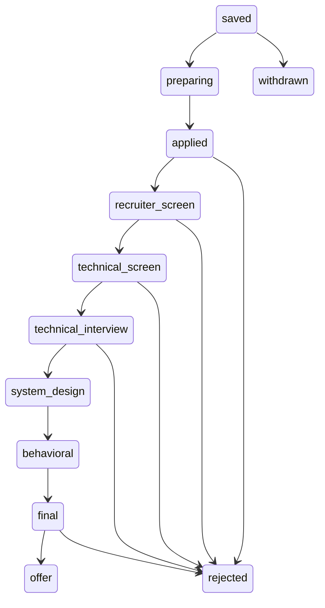

# EngForge — User Flows

## 1. Signup → first mission (the flow that decides everything)

Target: **under 4 minutes** from landing to a personalised Day 1 mission on screen.



### Onboarding wizard (§5)

| Step | Question | Writes to |
|---|---|---|
| 1 | Target role → maps to a **role track** | `career_profiles.role_track_id` |
| 2 | Experience level | `career_profiles.experience_level` |
| 3 | Where do you want to work? (multi) | `career_profiles.target_markets` |
| 4 | Companies that interest you (searchable + free-add) | `target_companies`, `companies` |
| 5 | Daily time + study days | `daily_minutes`, `study_days` |
| 6 | Technologies you already know (multi) | seeds `user_skills` priors, capped at 35 |

Design rules: one question per screen, keyboard-navigable, back always works,
progress bar, every step resumable (`onboarding_completed_at` null = resume here).
No step is mandatory except role track and daily minutes — the engine has
defaults for the rest.

### Calibration (skippable, high value)

8 adaptive questions across the role track's highest-weight skills. Each produces
a real `skill_evidence` row, so Day 1's plan is already targeted rather than
generic. Skipping is fine — the plan then leans on self-reported priors and
recalibrates within the first week.

**Why calibrate before planning:** without it the roadmap wastes week 1 on
material the user already knows, which is the fastest way to lose them.

---

## 2. The daily loop — Command Center (§15)



The Command Center shows exactly this, and nothing else above the fold:

```
TODAY · Wednesday, Week 3
Mission          Master PostgreSQL indexing
Time             60 min          XP available   +120
Streak           17 days 🛡2     Momentum       Forging 68

□ Review    9m   2 items due — HTTP caching, idempotency
□ Learn    15m   B-Tree indexes and when the planner ignores them
□ Build    15m   Add a composite index and measure the change
□ Explain   7m   Why might an index not be used?
□ Test      8m   3 interview questions
□ Research  6m   Compare B-Tree and Hash indexes

Finish condition: all six blocks closed.
```

Below the fold, and only below it: week context, recent wins, one nudge.
Everything else is a click away (§43 — progressive disclosure).

**The single nudge** rotates and is always specific and earned:
> Yesterday you struggled with idempotency. Today's build block is a webhook
> reliability challenge.

---

## 3. Learn → Explain



The four explanation levels (§28) are progressive-disclosure tabs, not four
pages. The **Explain** step is mandatory to close a topic — reading alone
produces the weakest evidence in the model and cannot complete a Learn block.

**Engineer Speak (§29)** runs on the explanation: when the AI eval flags imprecise
language, it offers the enterprise phrasing side by side with *why* it is better.

---

## 4. Build — Code Forge



Tracked per §60: attempts, time, hints used, mistakes, claimed vs actual
complexity, mastery movement. Claiming the wrong complexity is itself a scored
signal — it maps to the DSA skill, not to the problem.

---

## 5. Test — Interview Arena (§25, §27)



Rules that make it feel real: one question at a time, no ideal answer until the
session ends, follow-ups probe the weakest part of the last answer, and
communication is scored separately from correctness.

---

## 6. Research — Notebook & R&D Lab (§13, §14)

```
Question → Hypothesis → Research → Experiment → Code → Result
  → Evidence → Conclusion → Interview Explanation → Open Questions
```

Structured sections, markdown, autosave, private by default. Completing the
**Interview Explanation** section is what converts a note into `skill_evidence` —
research only counts once you can explain it.

Notes link to topics, skills, weaknesses, and other notes (`note_links`), and are
full-text searchable in global search (§50) — within the owner's own rows only.

---

## 7. Failure → Skill (§12) — the flow the product is named for



The user never has to decide what to do about a failure. The system already
scheduled it.

---

## 8. Interview Memory (§11)

After a real interview: company, role, stage, date, then **per question** —
what was asked and whether it went `strong` / `shaky` / `failed` / `unanswered`,
plus feedback, confidence, and anything unexpected.

Every `shaky` or `failed` question opens a weakness at severity 2 or 3 — the
highest-weight evidence in the entire model (2.5). Real interviews teach the
system more than anything else it can generate.

---

## 9. Career Mode (§47, §48)



Paste a JD → parsed requirements → gap report (Strong / Partial / Gap / Critical)
→ "prepare for this role" injects targeted items into the forward roadmap weeks.
An upcoming interview date reprioritises the daily plan automatically toward that
company's gap list.

---

## 10. Cross-cutting

**Command palette (⌘/Ctrl-K)** — start today's mission, open roadmap, search
topic, start interview, open notebook, start R&D, practice DSA, start system
design, view weaknesses, view revisions, add interview, add application.

**Global search (§50)** — topics, questions, own notes, applications, companies,
JDs, projects, designs, interview feedback. Grouped results, keyboard-first.

**Notifications (§55)** — revision due, streak at risk (only if a shield would be
spent), interview tomorrow, readiness moved, weakness resolved. Hard cap: **one
push per day**, digest-style. Silence is the default.

**Mobile (§51)** — the daily loop is fully usable on a phone: Learn, Explain,
Test, Research, Review. Code Forge and System Design Arena degrade to read-and-
review on small screens rather than pretending an editor works there.
