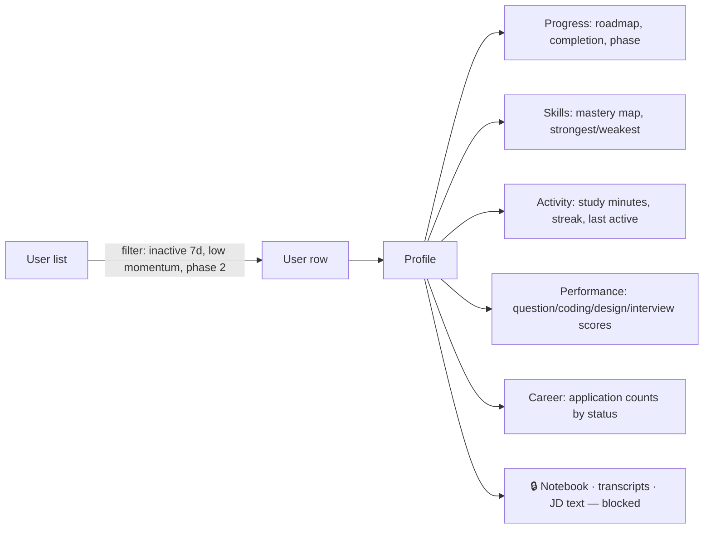
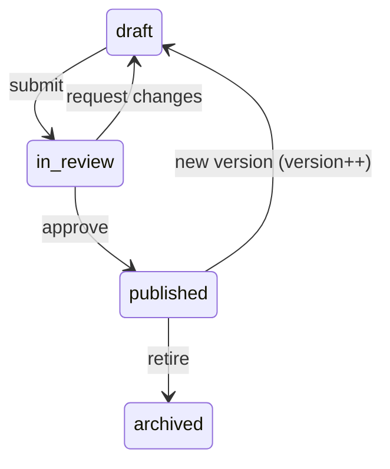

# EngForge — Admin Flows

The admin console is a **separate route group** (`(admin)/admin`), gated by
middleware, a server-side role check, and RLS. It is never a toggle on the user UI.

## 1. Roles (§36)

| Role | Can |
|---|---|
| `user` | own data only |
| `admin` | aggregate analytics, user progress inspection, content CMS |
| `super_admin` | everything above + role assignment + destructive content ops |

**Owner mode switching (§63).** The platform owner has both an admin role and a
normal learner account state. The console has an explicit switcher —
`Admin Console` ⇄ `My Progress` — with a persistent banner in admin mode. The
two never share a dashboard, so platform metrics can never be mistaken for
personal progress.

## 2. What admin can never see (§36, §65)

Enforced in RLS, not in the UI:

- `research_notes`, `note_links` — private notebooks and experiments
- `mock_interview_turns` — full interview transcripts
- `interview_records.notes_md` — personal reflections
- `job_descriptions.raw_text` — pasted JDs
- `system_design_attempts.submission_md` — design write-ups

Admin sees **scores, statuses, counts, and skills** from these areas — never the
prose. If a future feature needs deeper access, it requires an explicit,
audited, user-granted permission, not a role change.

## 3. Console map

```
/admin                    Overview
/admin/users              User list + segments
/admin/users/[id]         User profile (privacy-filtered)
/admin/analytics          DAU/WAU/MAU, retention, funnels
/admin/insights           Learning insights — what users struggle with
/admin/content            CMS: domains, skills, topics, questions, problems…
/admin/content/review     Draft queue
/admin/curriculum-gaps    Unmapped JD requirements → new skill candidates
/admin/audit              Admin audit log
```

## 4. Overview (§64)

```
USERS          total · active today · this week · new (7d) · churn risk
ENGAGEMENT     DAU · WAU · MAU · DAU/MAU stickiness
RETENTION      D1 · D7 · D30 cohort grid
LEARNING       avg study minutes/day · avg session length · avg streak
OUTCOMES       avg readiness · roadmap completion % · phase 1 → phase 2 conversion
CONTENT        most popular roadmap · hardest topic · most-failed question
```

Every tile links to the segment behind it — a number you cannot drill into is a
number nobody acts on.

## 5. User inspection (§32, §65)



Every load of `/admin/users/[id]` writes an `admin_audit_logs` row
(`action='view_user'`). Admin reads of user data are themselves auditable.

Segments that matter: *inactive 7d*, *streak broken this week*, *momentum
cooling*, *stuck on the same weakness 14d+*, *phase 1 ending in 7d*, *never
completed onboarding*.

## 6. Learning insights (§34) — the console's reason to exist

This answers **"what are users struggling with?"** so the curriculum can improve.

| Report | Source | Action it drives |
|---|---|---|
| Topic difficulty — failure rate per topic | `mv_topic_difficulty` | rewrite explanation, add prerequisite |
| Most-failed questions | `mv_question_failure_rates` | fix ambiguous wording, or accept it as genuinely hard |
| Most common weaknesses | `mv_common_weaknesses` | add depth to that skill's content |
| Drop-off points | `user_events` funnel | fix the flow, not the content |
| Time-vs-estimate drift | plan item actuals | recalibrate `estimated_minutes` |
| Unresolved weakness half-life | `weaknesses` | the revision loop isn't working for this skill |

Every insight row links straight into the CMS editor for that content.

**Distinguishing hard from broken:** a topic with high failure *and* high
time-over-estimate is badly explained. High failure with *on-estimate* time is
legitimately difficult. The report separates them.

## 7. Content management (§35)



Editable: domains · skills · prerequisites · role tracks and their weights ·
topics + the four explanation levels · questions + rubrics · coding problems +
tests · system design cases · boss battles · incident scenarios · projects ·
achievements · badges.

Guardrails:
- Publishing a topic requires all four explanation levels, ≥ 3 questions, and at
  least one skill mapping.
- Changing `role_track_skills` weights shows an impact preview: how many active
  roadmaps would change, and how much. Weight changes never rewrite completed weeks.
- Editing a published question with existing attempts creates a **new version**;
  historical attempts keep referencing the version they were scored against.
- Deleting content is soft (`archived`) — evidence rows must never dangle.

## 8. Curriculum gaps — market-driven growth

Unmapped `jd_requirements` (`skill_id is null`), aggregated by normalised label
and ranked by frequency across users' target markets:

```
"Kubernetes"        47 JDs   · 31 required  → [create skill] [alias to devops-containers]
"Terraform"         29 JDs   · 18 required  → [create skill]
"gRPC"              12 JDs   ·  4 required  → [alias to api-protocols]
```

The curriculum grows from what employers actually ask for, not from guesswork.
This is the loop that keeps EngForge honest about "the engineer companies want".

## 9. Audit (§37)

Logged: role changes, content publish/archive, user record views, analytics
exports, impersonation (if ever built), permission grants. Append-only,
`admin_only` read, never deletable through the app.
